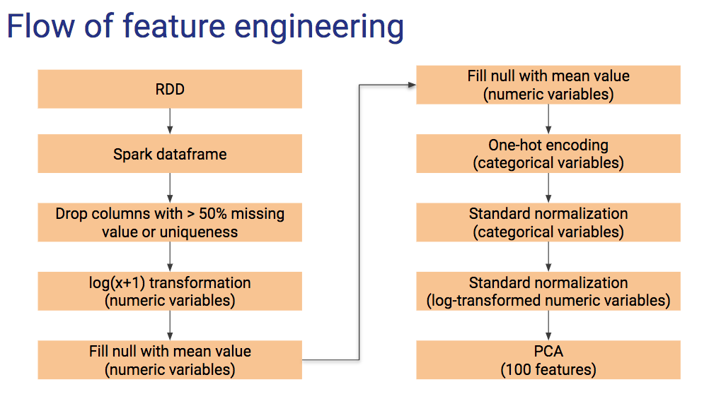

# Criteo Click-through-rate Prediction

### Kai Qi Lim, Chun-Jen (Curtis) Lin, Youzhi (Chloe) Wu, Eddie Zhu

In this project, the click-through-rate (CTR) of an advertisement is predicted based on a set of features. The Criteo training dataset is 12GB with a mix of numerical and categorical features, which were hashed into 32bits for anonymization. The main challenge of this project is the large size of the dataset and hundreds of features as a result of categories. 

In dealing with the large dataset, parquet file format was used in the toy dataset for scalability. A great deal of effort was spent on feature engineering to identify features to keep. Categorical features were one-hot encoded with PySpark mllib before conducting a principal component analysis. A toy dataset was first used to test the model and work flow before running the full dataset in Google Cloud. 

The final logistic regression model yielded a prediction accuracy 0.746 and log loss 0.535.

